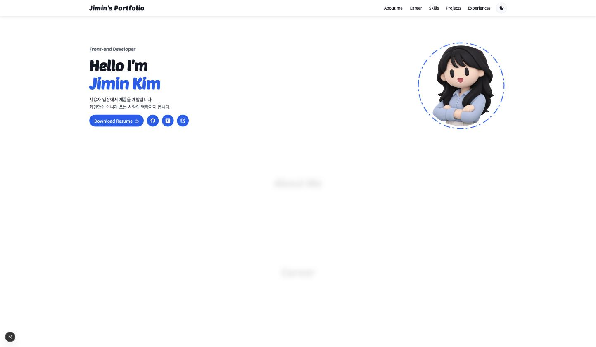
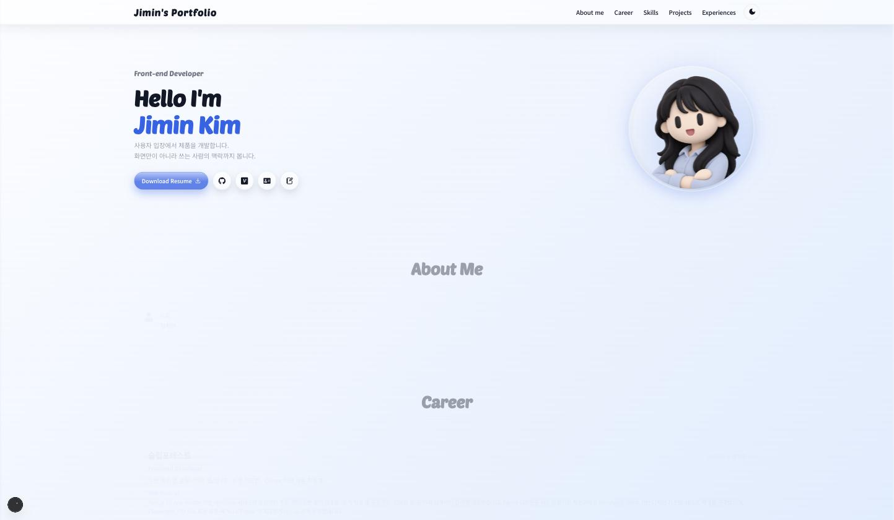
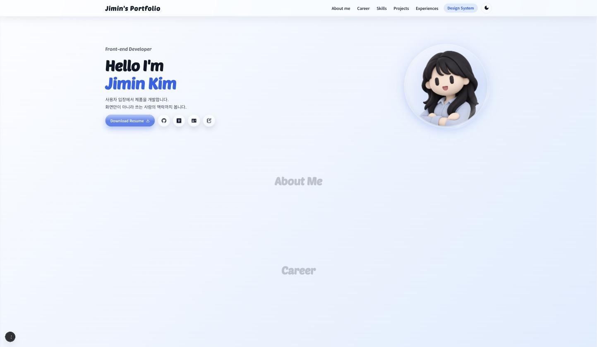
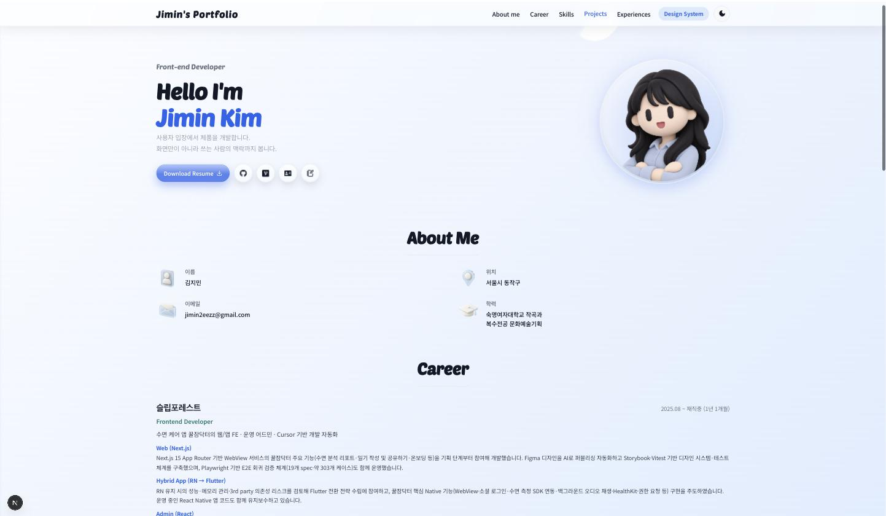
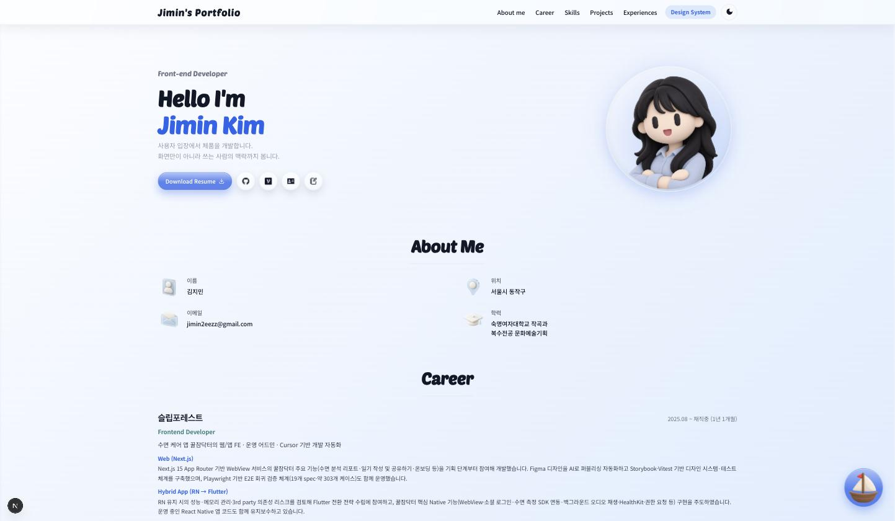
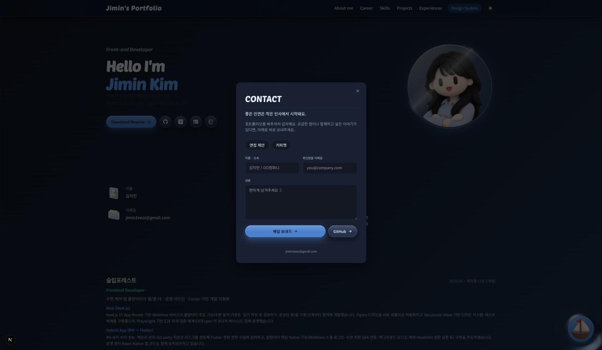
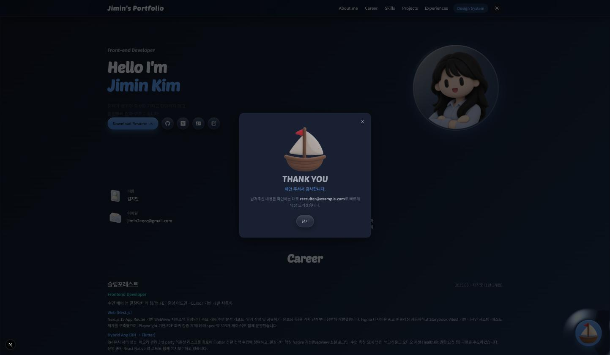

# 버전 기록 (Version History)

포트폴리오 디자인이 바뀌어온 흐름을 커밋 기준으로 캡쳐해서 남긴다. 각 스크린샷은
`docs/design-system/version-history/`에 실제 파일로 저장돼 있고, 아래 표의 커밋
해시로 언제든 그 시점 상태를 다시 재현할 수 있다(`git worktree add <경로> <hash>`).

## 타임라인 요약

| # | 상태 | 기준 커밋 | 비고 |
|---|------|-----------|------|
| v1 | 일러스트 아바타, 배경 효과·디자인 시스템 이전 | [`c9ba7ca`](https://github.com/wlals4264/bluemin-portfolio/commit/c9ba7ca) | Ambient 배경 도입 바로 전 마지막 상태 |
| v2 | Ambient water ripple 배경 + 아바타 교체 | [`eb86738`](https://github.com/wlals4264/bluemin-portfolio/commit/eb86738) (main 최신) | Soft Spatial 디자인 시스템 착수 전 |
| v3 | Soft Spatial 디자인 시스템 적용 (Icon3D, Badge, foundation 토큰, ProjectCard 등) | [`5e53f2f`](https://github.com/wlals4264/bluemin-portfolio/commit/5e53f2f) | `feat/soft-spatial-design-system` 브랜치, Contact 기능 이전 |
| v4 | Contact(커피챗 제안) 기능 + TopBtn 제거 | 현재 브랜치 작업 중 (미커밋) | 이 문서를 남긴 세션에서 진행한 작업 |

> **참고**: 실제 배포 사이트(`https://bluemin-portfolio.vercel.app`)는 이 표의 v1보다도
> 더 예전 배포가 떠 있을 수 있다 — 배포 파이프라인이 main의 최신 커밋을 아직 못
> 따라잡은 상태로 확인됐다(2026-09-10 기준). 정확한 시점 비교는 이 문서의 로컬
> 캡쳐 기준으로 하는 게 안전하다.
>
> profile.webp의 git 히스토리를 전부 확인해봤는데, 3번(`6f1989b` → `e2277ed` →
> `eb86738`) 모두 일러스트 아바타였고 실사 사진이 쓰인 커밋은 없었다 — "내 사진이던
> 시절"은 이 저장소 히스토리 밖(마이그레이션 이전 버전 등)일 가능성이 있다.

---

## v1 — 일러스트 아바타, 배경 효과 이전

기준 커밋: `c9ba7ca` (Add 3 preview highlights to the kkuljam project card)

Ambient 배경(jquery.ripples 물결)도, Soft Spatial 3D 아이콘 시스템도 들어오기 전.
아바타는 이후 `eb86738`에서 교체된 이전 버전 일러스트.

## v2 — Ambient 배경 + 아바타 교체

기준 커밋: `eb86738` (Swap hero profile photo for the new illustrated avatar, **main 브랜치 최신**)

물결 배경(`b68c854`)이 들어오고 아바타가 지금 쓰는 일러스트로 바뀌었다. 아직 About
Me/Career/Projects 등은 Icon3D·Badge 같은 디자인 시스템 컴포넌트 이전 상태.

## v3 — Soft Spatial 디자인 시스템 적용

기준 커밋: `5e53f2f` (`feat/soft-spatial-design-system` 브랜치, 이 세션 작업 시작 직전)

Icon3D 3D 아이콘 패밀리, GlassButton/GlassSurface, foundation 토큰 마이그레이션,
ProjectCard/Badge 통일 등 디자인 시스템 작업이 전부 반영된 상태. 아직 Contact
(커피챗 제안) 기능은 없다.

## v4 — Contact 기능 + TopBtn 제거 (현재)

기준: 현재 브랜치 작업 중(미커밋). 우측 하단에 배 모양 FloatingIconButton
(`ContactLauncher`)이 떠 있고, 클릭하면 Web3Forms로 메일을 보내는 `ContactModal`이
뜬다. 기존에 같은 자리에 있던 "맨 위로" 버튼(TopBtn)은 Contact 버튼과 겹쳐서
붐볐던 걸 없애고, 로고 클릭 시 스크롤 top으로 이동하는 방식으로 대체했다.

